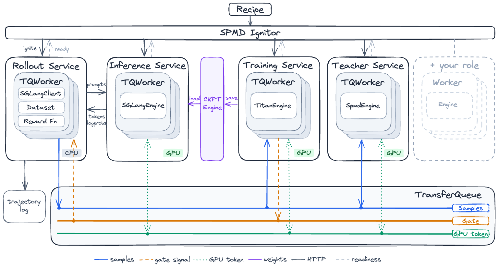
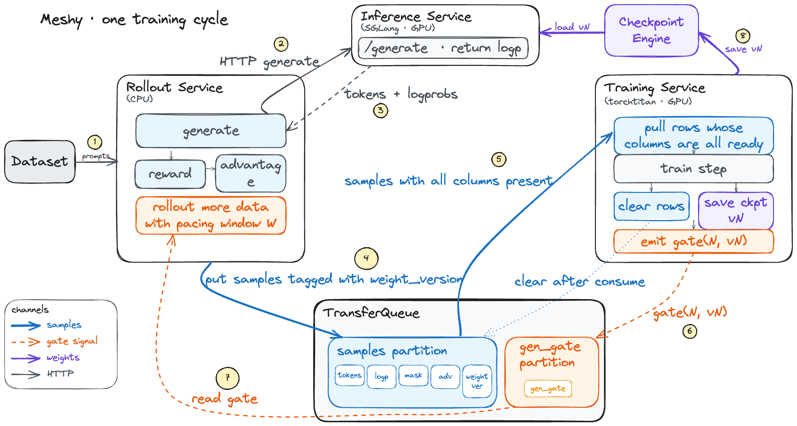

# Meshy: 角色驱动下 SPMD 范式的 RL 训练框架

**Tianyun Zhao**<sup>†\*</sup>**, Ao Sun**<sup>†\*</sup>**, Changlong Li, Yinghao Chen, Haoxuan Pan, Jinqian Zhang, Zekai Qu, Bingxiang He, ChaoJun Xiao, Xu Han**

**Github:** [https://github.com/OpenBMB/Meshy](https://github.com/OpenBMB/Meshy)

†: Project lead

\*: Core contributors

> - 我们提出了一个**没有中央控制器**的开源 RL 训练框架 **Meshy**：Inference、Training、Rollout、Teacher 均为独立服务，样本经 TransferQueue 数据面直达消费者，流程由**数据列的就绪状态**驱动，让 RL 训练回归预训练式的 SPMD 设计。
> - **Meshy 摆脱了Ray**，无需RPC调用：一条 `torchrun` 命令启动全部进程，每个进程按同一份 recipe **在本地确定性地推导拓扑**，运行时没有任务派发，大块 tensor 不经过任何编排进程。
> - 同一组服务通过服务化的角色组件自由组合出**同步 RL、有界异步、全异步流式训练和在线蒸馏（OPD）**：切换训练方式只需修改配置字段，新增角色无需改动框架主干；基于令牌环的多角色共置机制让任意角色组合共享同一组 GPU。
> - 基于 **TorchTitan** 与 **SGLang** 实现，代码已开源至 Github。

## 1. 引言

在过去的几年里，LLM RL 系统的工作负载发生了巨大的变化。早期的 RLHF 围绕同步训练展开：模型按固定顺序进行生成、打分和训练，每个阶段之间有着明确的同步边界。如今，系统还需要处理异步生成、持续训练、多轮 Agent 以及与外部环境的交互——那些在同步执行中原本隐含的状态、版本和故障边界，现在都必须显式地进行管理。

以 verl[1] 为典型代表的 Single-Controller 架构，用顺序程序表达异构的分布式计算，有效解决了同步 RLHF 时代最重要的编排问题。但一旦执行不再严格同步、任务开始跨越多轮训练，Single-Controller 就会逐渐从简化系统的抽象，变成数据传输和任务调度的阻碍。

越来越多的系统正在把通用的分布式编排框架从核心执行引擎的默认依赖中剥离，类似的解耦也发生在推理基础设施中。vLLM 在 V1 引擎中为多机张量并行和流水线并行提供了不依赖 Ray 的原生执行路径：各节点分别启动 vLLM 进程，由 PyTorch torch.distributed 建立跨节点进程组。

Meshy 正是在这一背景下提出的：我们将 Inference、Training、Rollout 和 Teacher 等角色建模为独立服务，不再将分布式编排框架作为 RL 系统的中心。所有样本数据通过统一的 TransferQueue[4] 数据面在服务之间流动，控制流程由数据来驱动，拓扑则由各进程在启动时在本地按相同配方推导，因此使得 RL 的流程更接近预训练框架常用的 SPMD 设计。

Meshy 结构天然支持全异步训练，同时兼容传统的同步训练。相比 Single Controller 设计，Meshy 避免了诸多的 RPC 调用，摆脱了沉重的分布式框架 Ray，在故障排查、性能、持续集成和代码简洁度上，都具有较大的优势。

## 2. 背景

### 2.1 经典 RLHF 流水线

以 PPO 为例，一轮传统的 RLHF 训练大致如下：

```text
Prompts
   |
   v
Actor Rollout ──> Reference / Reward / Critic Forward
   |
   v
Advantage Estimation ──> Actor & Critic Update ──> Next Iteration
```

这条流水线有三个重要特征。首先，各个阶段之间的同步是显式的，整个 batch 的 rollout 结束后才计算 reward 和 advantage，参数更新完成后下一轮才使用新权重。其次，同步 RLHF 的控制流固定，每一轮跑哪些阶段、阶段之间如何依赖，在训练开始前就已确定。第三，轨迹是一次性生成的，绝大多数样本是单次生成的结果，无需跨轮维护环境状态。因此，传统 RLHF 的计算组件虽然是异构的（Actor、Critic 和 Reward Model 可能使用不同的引擎和并行策略），但它的控制流是**同步、规则、可预测的**。换句话说，系统在任意时刻都处于某个确定的阶段——系统的状态变化遵循一条**全局统一的执行时序**。

### 2.2 Single-Controller：以顺序程序表达多机同步RL

训练和推理引擎内部通常遵循 SPMD 范式：各个进程运行同一份程序，进程间通过集合通信进行协作。SPMD 很适合表达单个模型的前向传播、反向传播，却难以表达顶层的 RL 流程——Rollout, Inference, Trainer 分属不同引擎、不同并行布局，SPMD 程序难以描述复杂的数据流向和执行顺序。因此，RL 框架通常需要在引擎内部的 SPMD 执行之上，再增加一层负责跨角色编排的控制面。

Single-Controller 给出的答案非常直接：既然系统遵循单一的全局执行时序，那就用一个顺序程序来编写它。Google 的 Pathways[3]（[arXiv:2203.12533](https://arxiv.org/abs/2203.12533)）最早系统地提出这一设计，verl 的 HybridFlow 将其与 SPMD 执行结合，成为 RL 训练框架的主流形态：**顶层控制流集中在一个进程里，每个角色对外表现为一个可调用的对象**：

```python
for step in range(num_steps):
    sequences  = rollout.generate(prompts)     # 一次“函数调用”
    rewards    = reward.compute(sequences)
    advantages = estimate_advantage(sequences, rewards)
    actor.update(advantages)
```

每次调用的背后，控制器把输入按数据并行切分、向所有 worker 进程发起远程调用、收集并合并分片结果。一组分布式计算就这样被折叠成一个普通的函数调用。

这个设计与同步 RLHF 的三个特征恰好一一对应：

- 显式的同步点，由函数返回天然表达：`generate` 一旦返回，就意味着整个批次的 rollout 已经完成，不需要任何额外的同步机制；
- 固定的控制流，由循环体直接承载：训练流程就是 Python 循环，修改代码就是修改流程。
- 单一的全局进度，由调用栈自然记录：循环计数器就是策略版本，程序执行到哪一行，系统就处于哪个阶段。

同步 RLHF 里那些隐含的状态——版本、阶段、依赖——恰好都能寄存在顺序程序的天然结构里，不需要任何显式管理。这正是 Single-Controller 与同步 RLHF 的耦合点：它好用的前提，就是“单一全局进度”的负载性质。

Single-Controller 在小规模的同步 RLHF 中几乎没有额外开销：一次 rollout 或参数更新动辄数秒甚至数分钟，中央进程派发调用的开销相比之下可以忽略。而收益却是实打实的：算法与分布式 infra 实现了解耦——调整算法只需修改 controller，替换引擎只需修改 worker；出了问题，沿着一个进程的调用栈就能定位到当前阶段、当前 batch 和失败的调用。工程上也发展得相当成熟，hybrid engine让训练和生成共置共享同一组 GPU、按阶段原地切换显存布局，进一步提高同步流水线的硬件利用率。对中小规模、流程固定的同步训练，这套设计的效率和开发体验至今仍是标杆。

### 2.3 Single-Controller设计的缺陷

Single-Controller 的整套抽象建立在一个假设上：系统只有一个统一的全局执行进度。当负载走向异步生成、持续训练和多轮 Agent 交互时，这个假设便失效了——同一时刻，系统里可能有多个权重版本的样本在生成，有轨迹停在工具调用上等待恢复，有训练正在消费上一个版本的数据。此时几个结构性问题开始显现：

1. **控制器成为数据通路的单点瓶颈。** 切分—执行—收集意味着每一步产生的轨迹、log prob 和 advantage 都要流经中央进程，它的带宽和内存成了全系统的瓶颈，规模越大，调度开销越大。
2. **每次调用都需要一次全局 Fan-out 与同步等待。** 控制器要向所有 worker 逐一发起远程调用，再等最慢的那个返回。batch 的完成时间由最长的样本决定，输出长度差异越大，便会浪费越多算力。
3. **寄存在程序结构里的状态无处安放。** 当一个 batch 混着多个策略版本、一条轨迹跨越多次参数更新时，“函数是否返回、循环走到第几轮”表达不了这些状态。若继续把它们塞进中央进程，顺序程序就会变成一个手写的分布式状态机——与 Single-Controller 的意义背道而驰。
4. **异步能力只能运行在主流程之外。** 主循环的形态是同步的，异步就只能以并行分支或实验模块的方式接入。每个模块从控制器移走一部分职责，但编程接口仍是顺序调用。

值得注意的是，社区的演进也在印证这一点。verl[1] 引入独立的数据队列 TransferQueue[4]，让样本绕开 driver 直达消费者，异步训练则由独立的 fully-async 分支承担；slime[2] 把推理端做成独立的 HTTP 服务、数据经对象存储传输，顺序 driver 只剩不到一百行。**单控制器框架自己也在一步步把数据传输、推理服务和异步驱动从控制器里搬出去。**这自然引出一个问题：如果这些职责都已独立，RL 框架是否还需要保留中央控制器？

## 3. Meshy

Meshy 是我们对上述问题提出的解决方案：与其不断扩充 Single-Controller 设计，不如从一开始就将系统建模为一组通过精简接口协作的服务。Meshy 基于 TorchTitan[5] 和 SGLang[6] 实现了完整的 RL 与蒸馏训练：其不依赖 Ray，也没有中央调度器；服务之间只通过队列中的数据列约定、控制生成进度的 gate 信号，以及少数用于健康监测的 HTTP 管理端点进行协作。

### 3.1 设计目标

Meshy 的设计围绕两个目标：

**目标一：尽量降低通信和调度开销。** Single-Controller 的开销主要来自三处：中央进程批量发出 RPC 并回收结果、数据在控制器中完整加载和序列化，以及每个阶段的全局同步。Meshy 直接从架构上移除这些环节：各进程在本地推导拓扑，运行时无需派发任务；数据通过独立的数据面从生产者直达消费者，不经过编排进程；同步只依赖每个权重版本对应的一条控制信号，无需全局 barrier。

**目标二：让开发者自由组合不同的组件。** 系统中的每个角色实现同一个 Service 接口，一次训练的完整拓扑由一份声明式的 `ServiceGroup` 列表定义。更换算法、调整拓扑或增加新角色，都只需编辑这份列表，而无需修改框架。

### 3.2 一切皆服务：Service 与 ServiceGroup

Meshy 中，每个角色：Inference、Training、Rollout、Teacher 等都以 Service 的形式存在，在 recipe 中以 DataClass 的方式进行定义。

Meshy recipe 中由开发者定义的配置由两部分组成：

- `ServiceGroup` 描述一组相同角色的服务实例，包括稳定的 id、类型化 config、副本数以及每个副本使用的 GPU 数；
- `ColocationRing` 描述共置的 ServiceGroup，以及它们在共置 GPU 上的调度模式与顺序。

下面是一个完整的训练拓扑示例：

```python
SERVICE_GROUPS = [
    ServiceGroup(
        id="actor_infer",
        config=InferenceConfig(...),
        n_replicas=1,
        n_gpus_per_replica=8,
    ),
    ServiceGroup(
        id="actor_train",
        config=TrainingConfig(...),
        n_replicas=1,
        n_gpus_per_replica=8,
    ),
    ServiceGroup(
        id="rollout",
        config=RolloutConfig(pacing_window=1, ...),
        n_replicas=1,
        n_gpus_per_replica=0,
    ),
]
COLOCATIONS = [
    ColocationRing(
        group_id="actor_card",
        ring=(
            ("actor_infer", SchedulingMode.FALLBACK),
            ("actor_train", SchedulingMode.ON_DEMAND),
        ),
    ),
]
```

在 Meshy 中，Service 之间不存在一个中央控制器显式编排执行顺序。上下游关系由 TransferQueue 中的数据可用性隐含表达：生产者写入某些列，消费者声明自己需要的列，只有当一条样本的全部依赖列都已经存在时，它才会被消费者取走。这使得数据本身就承担了流程推进的信号。关于 TransferQueue 的技术细节将在 3.4 节进行介绍。



这样的设计让 Meshy 成为了一个松耦合的框架：对每个 Service 而言，只要输入输出列契约保持稳定，上游和下游就可以独立实现、替换和扩展。开发者仅需通过 `ServiceGroup` 选择参与流程的角色，由 TQ 列契约决定角色间数据的数据传输，通过 `ColocationRing` 指定共置模式，即可自由组装实现同步RL，异步RL，OPD 或新的训练配方，而非复制一套新的中央控制流程。共置场景下，多个 GPU 角色可以在同一组卡上自由共置。Inference、Training、Teacher 或其他计算角色只要加入同一个共置环，就可以共享统一的资源仲裁机制；每个角色仍然保留自己的 Engine, Worker 和业务逻辑。3.5 和 3.6 节将进一步介绍这些能力。

### 3.3 无需中央调度器的启动：确定性的拓扑推导

服务化架构通常首先要解决服务发现问题：每个服务位于哪台机器、使用哪个端口？常见方案是使用注册中心或配置文件，但这会增加需要维护的组件。Meshy 采用了一个更简单的办法：**用纯函数计算拓扑。**

Meshy 以 SPMD 方式启动：一条 `torchrun` 命令在每张 GPU 上运行一个**启动进程（ignitor）** ——它不承担任何训练计算，只负责推导拓扑、拉起分配到本卡的服务并守护其生命周期。启动时，所有 ignitor 通过 all-gather 获得全局 GPU 列表（每张卡的主机和 rank），然后每个进程独立执行同一个**确定性纯函数**：以服务声明列表和 GPU 列表为输入，计算每个服务实例的完整部署信息——使用哪些 GPU、位于哪台主机，以及服务地址和分布式端口。端口根据副本主卡的 rank 按固定规则计算，只要声明列表和 GPU 列表相同，每个 ignitor 得到的拓扑就完全相同。由此，Meshy 不需要注册中心，也无需在进程间传递服务地址，每个进程都在本地算出完整拓扑；Meshy 也没有运行时任务派发，每个 ignitor 查询拓扑，只启动分配到本卡的服务。

这种方式带来的不仅是组件减少，还有更强的可复现性和可调试性：同一份 recipe 在相同 GPU 拓扑下会得到相同的部署结果；端口冲突、GPU 数量不足、共置环错配等错误也能在启动阶段被发现，而不是等到服务运行后才暴露。

### 3.4 数据传输与流程控制

服务之间的协作分为三类，分别使用适合的通信方式。其中数据面和控制面都构建在 **TransferQueue（TQ）**​[4] 之上——一个独立开源的后训练数据系统（[Ascend/TransferQueue](https://github.com/Ascend/TransferQueue)），所以先介绍它的模型。

可以把 TQ 理解为若干张**固定容量的样本表**。每张表在 TQ 里叫一个**分区（partition）**；样本是表中的一行，行上是一组命名的**数据列**（token、logprob、advantage……），不同角色可以分别往同一行补写不同的列。TQ 自身由两类进程组成：**controller** 只负责记录元数据——每一行的哪些列已经生成、被谁消费过；**storage** 保存真正的 tensor。消费者先向 controller 查询哪些行已经就绪（只传元数据），再直接从 storage 拉取数据，因此大块 tensor 不经过任何中间进程。

对于数据面，Meshy 使用 TransferQueue 上的特定分区在角色间传输数据。每个使用 TransferQueue 的角色，都需要在 recipe 中声明其消费的数据分区和数据列。角色启动后便会轮询 TransferQueue controller，获取所有消费数据列均已准备好的样本。样本收齐后，角色会在本地调用自己的 Engine 执行计算逻辑。计算逻辑完全由角色实现决定，并需将计算结果写回到 TransferQueue 中供下游消费。末端消费者在消费样本后会将样本从 TQ 中销毁，以防止 TransferQueue 的存储出现不可控的增长。

与 Single-Controller 架构不同，Meshy 没有一个中央循环依次调用 Rollout、Teacher 和 Trainer。各个 Service 独立运行，按照自己的轮询频率和计算速度推进。消费者拉取数据时声明自己需要哪些列，查询只返回**所有**指定列都已生成的样本。列的生成状态本身就是就绪信号，因此生产者和消费者无需显式握手；消费记录按消费者身份分别维护，多个消费者也不会互相争抢数据。这一点在蒸馏场景中最明显（见 3.7 节）：Trainer 把 Teacher 的评分列加入自己所需的数据列，Teacher 写回结果后，样本自然就对 Trainer 可见，无需再发送“评分完成”通知。

对于控制面，除了先前提到的隐含传递之外，也存在一些控制信号需要显性地被传递。比如，在同步RL中，Rollout 需要根据 Trainer 当前训练的权重版本控制数据集的读取节奏。对于每个信号，我们利用 TransferQueue 单独的一个数据分区进行传递，以上文为例，Trainer 每个 step 训练结束后会在 gen-gate 分区写入包含最新权重版本的 gate 信号，Rollout 在每次读取数据集前通过访问该分区确定最新权重版本，利用这一信号决定读取的样本数量。

完整数据流如下：



这个设计遵循两项重要原则：

**tensor 不再经过编排进程。** Meshy 没有中央控制器，Rollout 也不负责转发数据：它写入 TQ 的正是自己生成的样本，trainer 则按约定自行拉取，元数据与 tensor 分开传输。相比之下，verl 默认会在 driver 中完整加载并转发所有样本数据，这是两种架构最实质的区别。值得一提的是，verl、ROLL[7] 等单控制器框架也在引入 TransferQueue，但用途有所不同：在这些框架中，它是缓解 driver 数据瓶颈的可选优化；在 Meshy 中，它是唯一的数据传输方式。这种设计将数据传输职责彻底从编排进程中剥离出来，不仅避免了中心化的数据瓶颈，也带来了更清晰的职责边界和更好的横向扩展能力。

**同步只依赖一系列简单的控制信号。** 系统不需要分布式锁、barrier 集合通信或跨服务事务。控制信号本身具有顺序和可追踪性，开发者观测 TransferQueue 的信号传递情况即可掌握当前框架的全局运行状况，并可判断事件是否丢失、乱序或重复消费。既让 Service 之间保持松耦合，又为版本、节拍和资源所有权等全局状态提供了必要的显式同步。

### 3.5 拓扑即配置：基于令牌环的多角色共置

GPU 拓扑是 RL 训练中最重要的效率决策之一，Meshy 将它完全交给声明式配置。服务只需描述自己需要的 GPU 能力以及参与的共置关系：分离部署（disaggregate）时，两者使用不同的 GPU 并行运行；共置部署（colocate）时，多个角色共享同一组 GPU，并在运行时交替获得使用权。因而，切换拓扑只需调整配置，新增角色或改变并行布局也不需要修改既有服务的业务逻辑。

> ✨ 先前框架通常仅实现了训推共置的切换逻辑，在 OPD 等复杂场景中需要逐 recipe 针对性地适配多角色切换逻辑。为了进一步提升此类复杂场景下的开发体验，我们开发了基于令牌环的多角色共置机制，其允许任意数量的角色共同占用一组 GPU，且在各个角色之间按需分配 GPU，不指定唯一的切换上下游，实现动态的资源调度。

Meshy 的共置机制仅需开发者进行最小适配：每个服务只需要将依赖 GPU 的代码放置在 GPU 上下文中，并为该上下文提供显存释放和恢复所需的接口。当服务运行到 GPU 上下文时，系统会先暂停当前执行流程，并向令牌环提交 GPU 使用请求。只有获得 GPU 令牌的角色，才能继续执行上下文中的 GPU 代码。角色取得令牌后，系统会调用该角色注册的显存恢复接口，将此前保存的模型、缓存或中间状态重新加载到 GPU 上，然后执行对应的计算逻辑。上下文执行完成后，服务会调用显存释放接口清理当前角色占用的 GPU 状态，并将令牌移交给令牌环中下一个等待 GPU 的角色。对于暂时没有请求角色的情况，令牌将会传递到 Inference 等 fallback 服务，保障样本的正常产出。令牌请求与授予均通过 TransferQueue 实现，请求令牌时在 TransferQueue 中新建一行，而授予令牌则在该行的数据列上进行标记。

这种机制将 GPU 使用权从固定绑定的资源关系，转化为多个角色之间可协调、可调度的动态资源访问。开发者不需要为每一种角色组合单独实现复杂的显存切换逻辑，只需要实现统一的释放和恢复接口，并在 recipe 中显式定义参与共置的角色以及它们所属的共置令牌环，即可完成多角色 GPU 资源协同。例如，在 Inference-Teacher-Training OPD 场景中，Inference 角色作为 fallback 服务，在 Teacher 和 Training 没有请求时使用 GPU，承担推理任务。当 Teacher 或 Training 产生按需请求时，系统会暂停 Inference，调用其显存释放接口，并将 GPU 令牌交给对应的服务。Teacher 获得令牌后完成蒸馏计算，将令牌交给 Training 恢复训练状态并执行参数更新。按需任务完成后，服务释放自身占用的显存并归还令牌，Inference 随后恢复显存状态，重新接管 GPU 资源。

得益于这一能力，服务之间的组合关系不再受限于预先固定的角色搭配。开发者可以按照业务需求自由组合不同角色，在有限 GPU 资源下构建更加灵活的多角色共置 recipe。

### 3.6 组件组装：自由设计角色，无需修改框架

服务架构最直接的好处是可以通过 recipe 灵活组合角色和调度策略。Meshy 的 recipe 展示了同一组服务的几种组合：

- 同步GRPO：锁步窗口的基线配置；添加一个共置环即可从分离架构切换至共置架构。
- JustRL：同一模型、同一超参，窗口从 `1`（锁步）到 `2`（有界异步重叠）再到不限（全异步 + 流式 mini-batch），三个 recipe 的差异只有配置字段；
- OPD：需要引入全新角色，是对这套架构能力最完整的验证。

OPD 需要一个全新的角色：**Teacher 服务**，使用冻结的大模型为 Student 的 Top-K 候选打分。它的接入方式综合使用了前面介绍的各项机制：

- **实现上，Teacher 与 Trainer 是并列的 Service，而非继承关系。** 两者构建在同一个 GPU 引擎基座之上：每张 GPU 运行一个引擎子进程，各自拥有独立的计算通信组和控制通信组，由 rank 0 广播命令并对外提供管理接口。每个角色只需实现初始化、执行、管理接口和后台任务四类钩子。Teacher 引擎本身没有 optimizer，也不包含训练服务使用的权重更新逻辑。
- **数据上，蒸馏流程完全由所需的数据列定义。** Rollout 写入 Student 的 Top-K 候选及对应的 logprob；Teacher 作为消费者读取样本，打分后把结果**写回同一个样本**；Student trainer 将打分列加入自己的数据要求后，便只会看到 Teacher 已完成打分的样本，三方无需显式握手。
- **资源上，三个共置服务的显存交接由令牌环机制管理。** 共置模式下，Inference、Teacher 和 Training 作为同一条令牌环的成员，通过 TQ 上的特定分区传递 GPU 令牌。Teacher 仅需实现释放与恢复显存的接口，即可直接接入共置令牌环。运行中，Trainer 获取足够样本后向令牌环提交 GPU 请求，从 Inference 或 Teacher 处获取令牌，随后恢复内存展开训练。在分离部署下，这些调用自动变为空操作，业务代码不需要额外判断拓扑。

这些改动不需要修改推理服务、训练服务或 ignitor 的核心逻辑。开发者仅需实现新的服务，并编写新的服务声明列表，即可自由组装各个组件，实现新的训练方式。在单控制器框架中引入新的角色，通常要写一个新的 Worker 类并注册它的数据分发方式，在中央训练循环里插入计算逻辑，再到共享显存管理中增加分支——每一步都需要修改框架主干。在 Meshy 中，实现同样的目标仅需三步：实现新的服务、在 recipe 中维护配置、把产物加进下游的数据要求，改动全部落在实验的 recipe 和服务的代码里。

## 4. 服务化设计的付出与回报

将 RL 系统拆分为多个自主运行的服务，会改变计算流程的推进方式，也会重新分配原本由中央控制器承担的职责。服务化为什么能够降低运行开销、简化新配方设计，并改善系统治理和故障排查？下面我们通过几个关键问题，说明 Meshy 是如何进行优化的。

> 🤔 **为什么服务化反而能降低开销？**
> 直觉上，服务数量增加似乎会带来更多进程间通信和协调成本。但在 Single-Controller 中，每个阶段都要由中央控制器切分任务、派发调用、回收结果，并等待整个阶段完成；数据和控制集中经过同一条路径，角色越多，这个中间环节承担的调度、通信和同步负担就越重。

> 💡 **Meshy 让服务自主推进流程，省去中央控制器的调度开销**
> Meshy 的各个服务按照数据是否就绪自主推进，不需要中央控制器逐一派发任务、回收结果或等待阶段完成。样本由生产者直接交给下游消费者，生成和训练也可以并行进行。
> 因此，新增角色只增加自身的计算和数据处理，不会额外增加中央调度路径，通信与调度开销也不会随着角色数量线性叠加。

> 🤔 **如何在不修改框架主干的情况下引入新的流程？**
> Single-Controller 将角色调用和阶段顺序写在中央循环中，流程变化往往伴随控制逻辑、数据分发和远程调用接口的修改，这使得新算法的接入成本不断增加。

> 💡 **开发者可通过数据契约和独立服务组合算法流程。**
> Meshy 将流程拆成数据列契约和独立服务，角色之间通过 TQ 连接，算法流程可以在不改变框架核心的情况下重新组合。不同运行模式共享同一套基础设施，可以借助角色组合与列契约方便地实现新的 recipe。

> 🤔 **Meshy 如何改变排障体验？**
> 在基于 Ray 的架构里，一次故障常表现为 driver 卡在某个远程调用上：任务在集群里挂起却没有 traceback，或者异常被包装成层层嵌套的远程错误。

> 💡 **可通过服务进程日志和可观测的队列状态定位故障。**
> Meshy 的每个服务都是普通的本地进程，异常直接落在该服务自己的日志里，携带完整的调用栈；框架同时提供对 TransferQueue 的观测能力，服务出现异常时，观察队列中的样本堆积即可定位。

### 需要付出的代价

服务化同样存在成本，主要体现在两个方面：

> 💭 **调试需要跨进程进行。** 在单控制器中，一个断点就能查看全局状态；在 Meshy 中，一次训练涉及启动器、Inference、Trainer、Rollout 和 TransferQueue 等多类进程，因此诊断主要依赖日志和队列状态，而不是单一调用栈。为降低调试难度，我们尽量保持协议简单（一组数据列约定、一组 gate 信号和少数管理端点），并为各层提供可独立运行的测试。窗口行为、gate 信号以及数据写入和读取都有基于真实 TQ 的单元测试。

> 🔥 **TQ 成为必需的基础设施。** 数据面和控制面都通过 TransferQueue 实现，每次启动都要额外运行一组 controller 和 storage 进程。ignitor 会自动计算容量并完成服务发现，训练配置通常无需关心 TQ 的细节，但使用者仍需要理解和维护这一组件。这是统一各种运行模式的数据传输方式所带来的成本。

社区也在从不同方向探索类似的架构。verl 使用 TransferQueue 分离数据传输，并通过 server 模式将 rollout 变成独立副本；slime 将推理端实现为可部署在外部集群的 HTTP 服务；小红书开源的 Relax[8] 则把每个 RL 角色部署为 Ray Serve 服务，通过策略滞后限制来驱动全异步训练。它们的演进路径有所不同：这些框架从单控制器出发，逐步移出各项职责；Meshy 则从一开始就不设置中央进程。Meshy 也采用了与 verl 相同的开源数据组件 TransferQueue，但它在这里不是可选的性能优化，而是唯一的数据面。最终，Meshy 只用一条数据队列、一组控制信号和少数管理端点来连接各个服务。

## 结语

单控制器的核心价值在于：当系统有单一的全局进度概念时，Single-Controller 可以用简单的顺序程序表达复杂的分布式计算。它很好地解决了同步 RLHF 时代的问题，直到今天，对小规模、流程固定的训练依然是很好的选择。

但当 RL 的最小进度单位从“一轮训练”变成“一条轨迹、一个版本、一个服务”时，中央进程就不再适合作为整个系统的边界。Meshy 将系统拆分为一组通过简单协议协作、各自独立运行的服务：各进程在本地推导拓扑，数据通过统一队列送达消费者。这样可以从架构上减少通信和调度环节，并用同一组组件实现同步RL、全异步 RL 与 OPD 等不同训练配方。

## 参考文献

[1] Sheng G, Zhang C, Ye Z, et al. HybridFlow: A flexible and efficient RLHF framework. *Proceedings of the 20th European Conference on Computer Systems (EuroSys)*, 2025. [arXiv:2409.19256](https://arxiv.org/abs/2409.19256). Code: [verl-project/verl](https://github.com/verl-project/verl)

[2] THUDM. slime: An SGLang-native post-training framework for RL scaling. *GitHub repository*, 2025. Code: [THUDM/slime](https://github.com/THUDM/slime)

[3] Barham P, Chowdhery A, Dean J, et al. Pathways: Asynchronous distributed dataflow for ML. *Proceedings of Machine Learning and Systems (MLSys)*, 2022. [arXiv:2203.12533](https://arxiv.org/abs/2203.12533)

[4] Ascend. TransferQueue: An asynchronous streaming data management module for efficient post-training. *GitHub repository*, 2025. Code: [Ascend/TransferQueue](https://github.com/Ascend/TransferQueue)

[5] Liang W, Liu T, Wright L, et al. TorchTitan: One-stop PyTorch native solution for production ready LLM pre-training. *International Conference on Learning Representations (ICLR)*, 2025. [arXiv:2410.06511](https://arxiv.org/abs/2410.06511). Code: [pytorch/torchtitan](https://github.com/pytorch/torchtitan)

[6] Zheng L, Yin L, Xie Z, et al. SGLang: Efficient execution of structured language model programs. *Advances in Neural Information Processing Systems (NeurIPS)*, 2024. [arXiv:2312.07104](https://arxiv.org/abs/2312.07104). Code: [sgl-project/sglang](https://github.com/sgl-project/sglang)

[7] Wang W, Xiong S, Chen G, et al. Reinforcement learning optimization for large-scale learning: An efficient and user-friendly scaling library. *arXiv preprint* [arXiv:2506.06122](https://arxiv.org/abs/2506.06122), 2025. Code: [alibaba/ROLL](https://github.com/alibaba/ROLL)

[8] Zhang L, Ning B, Yang R, et al. Relax: An asynchronous reinforcement learning engine for omni-modal post-training at scale. *arXiv preprint* [arXiv:2604.11554](https://arxiv.org/abs/2604.11554), 2026. Code: [redai-infra/Relax](https://github.com/redai-infra/Relax)

[9] He B, Qu Z, Liu Z, et al. JustRL: Scaling a 1.5B LLM with a simple RL recipe. *arXiv preprint* [arXiv:2512.16649](https://arxiv.org/abs/2512.16649), 2025. Code: [thunlp/JustRL](https://github.com/thunlp/JustRL)

---

如果您认为这篇文章对您有所帮助，欢迎引用本文。

```latex
@misc{zhao2026meshy,
    title   = {Meshy: 角色驱动下 SPMD 范式的 RL 训练框架},
    author  = {Tianyun, Zhao and Ao, Sun and Changlong, Li and Yinghao, Chen and Haoxuan, Pan and Jinqian, Zhang and Zekai, Qu and Bingxiang, He and ChaoJun, Xiao and Xu, Han},
    year    = {2026},
    url     = {https://maydomain.notion.site/Meshy-SPMD-RL-3bc4e1dff05a801bbf2aebd81cab6472},
    note    = {Blog post},
    urldate = {2026-09-06},
 }
```
